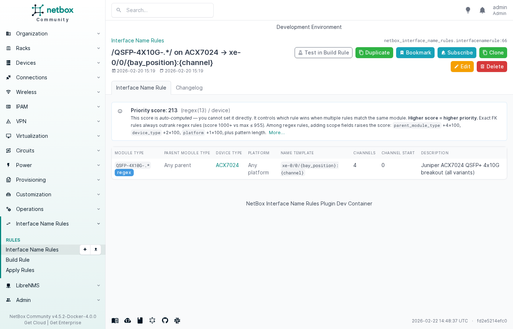
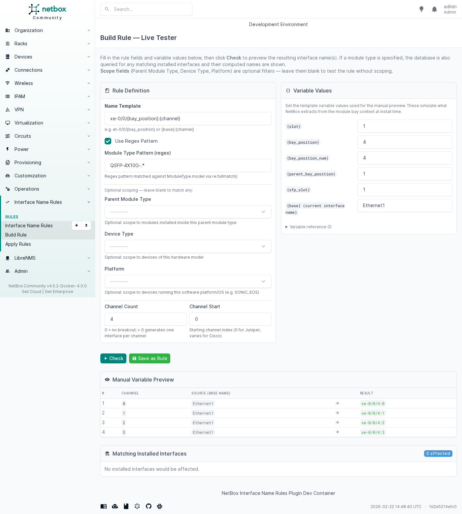
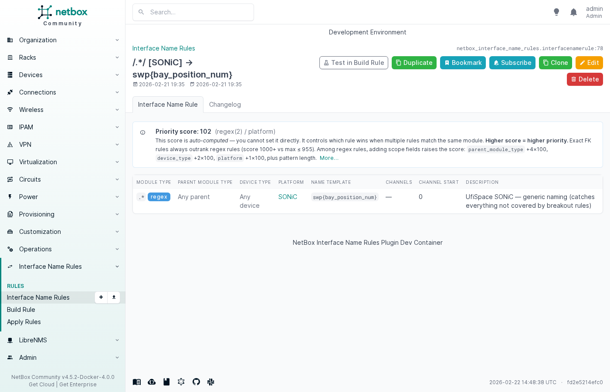
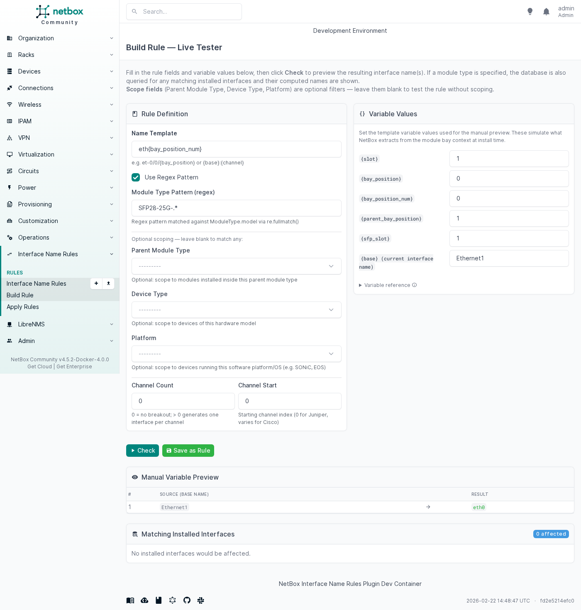
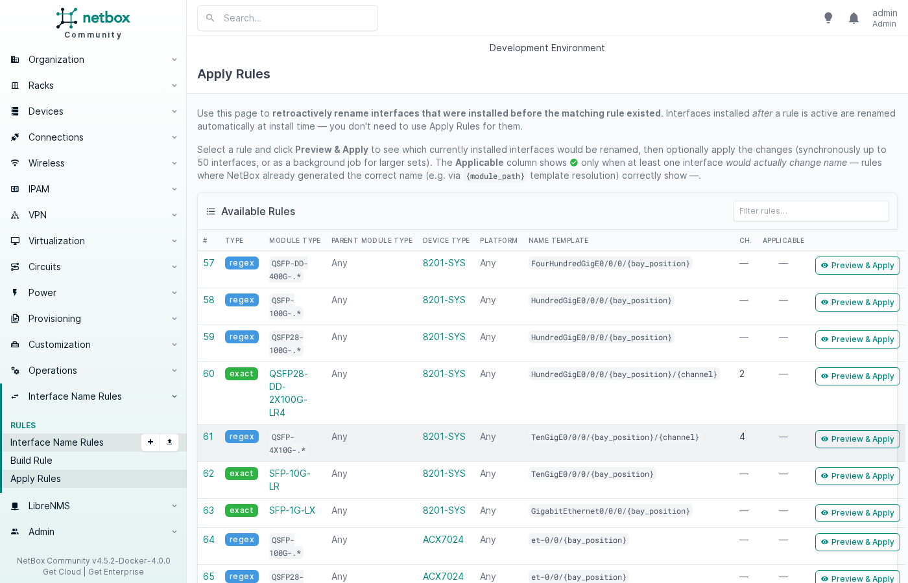
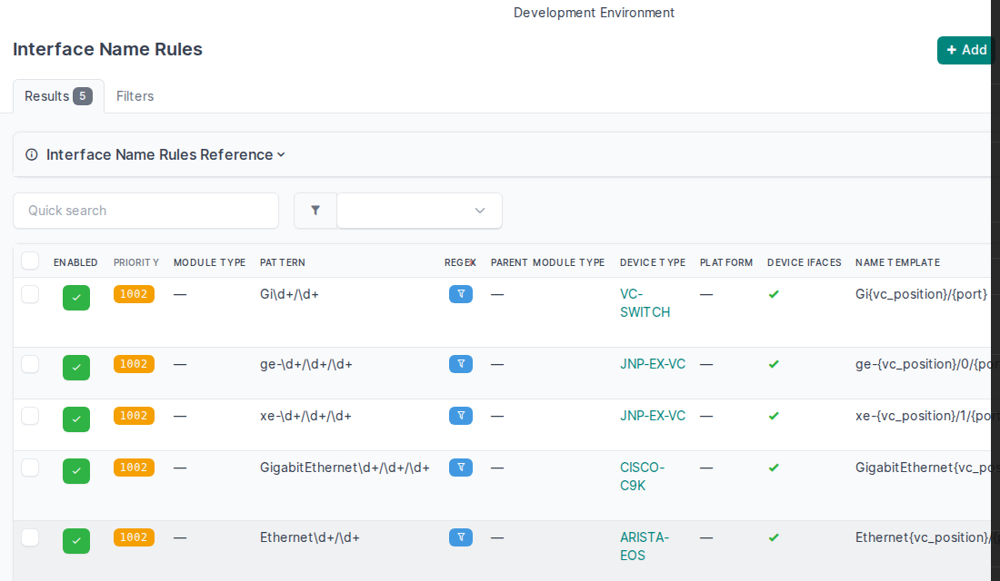
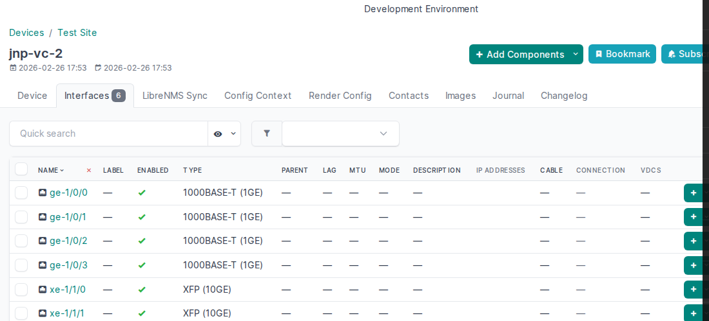
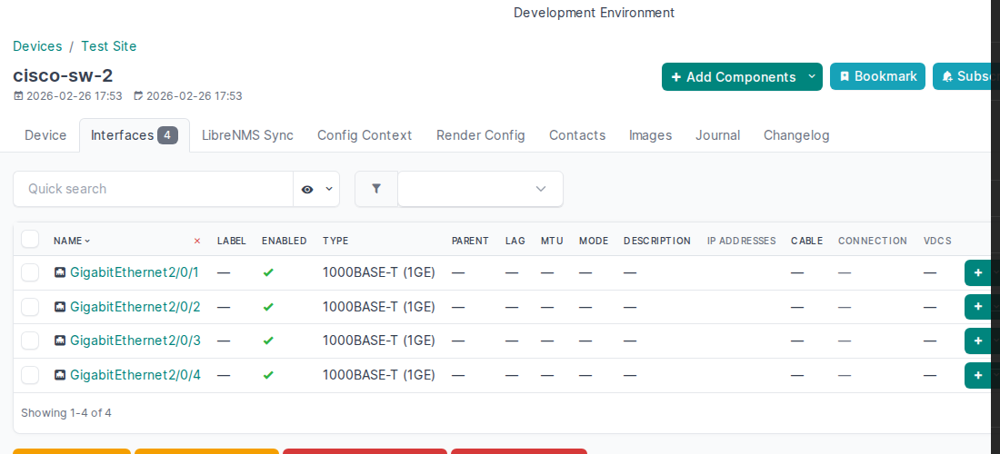
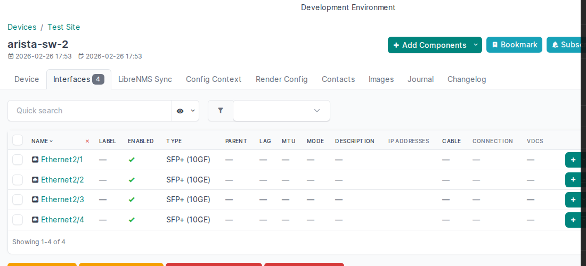

# Examples

This page shows real-world rules for common vendors and use cases. All YAML
snippets can be imported via **Interface Name Rules → Import**.

## Juniper (ge / xe / et)

Juniper uses a three-tier interface naming scheme where the *prefix* encodes
the speed: `ge-` (1G), `xe-` (10G), `et-` (100G / 400G). The suffix follows
the `FPC/PIC/port` convention — for pizza-box ACX devices this simplifies to
`0/0/{port}`.

### Rule overview for ACX7024

| Module type pattern | Name template | Channels | Result |
|---|---|---|---|
| `QSFP-DD-400G-.*` | `et-0/0/{bay_position}` | — | `et-0/0/4` |
| `QSFP-100G-.*` | `et-0/0/{bay_position}` | — | `et-0/0/7` |
| `QSFP28-100G-.*` | `et-0/0/{bay_position}` | — | `et-0/0/2` |
| `QSFP-4X10G-.*` | `xe-0/0/{bay_position}:{channel}` | 4 (start 0) | `xe-0/0/4:0` … `xe-0/0/4:3` |
| `QSFP28-DD-.*` | `et-0/0/{bay_position}:{channel}` | 2 (start 0) | `et-0/0/3:0`, `et-0/0/3:1` |
| `SFP-10G-LR` (exact) | `xe-0/0/{bay_position}` | — | `xe-0/0/12` |
| `SFP-1G-.*` | `ge-0/0/{bay_position}` | — | `ge-0/0/0` |

### YAML (excerpt from `contrib/juniper.yaml`)

```yaml
# 100G QSFP28 (all variants) → et-0/0/X
- module_type_pattern: "QSFP-100G-.*"
  module_type_is_regex: true
  device_type: ACX7024
  name_template: "et-0/0/{bay_position}"
  description: "Juniper ACX7024 100GE QSFP28 naming (all variants)"

# 10G SFP+ (exact FK match) → xe-0/0/X
- module_type: SFP-10G-LR
  device_type: ACX7024
  name_template: "xe-0/0/{bay_position}"
  description: "Juniper ACX7024 10GE SFP+ naming"

# 1G SFP (regex) → ge-0/0/X
- module_type_pattern: "SFP-1G-.*"
  module_type_is_regex: true
  device_type: ACX7024
  name_template: "ge-0/0/{bay_position}"
  description: "Juniper ACX7024 1GE SFP naming (all variants)"
```

**Rule priority tip:** The exact FK rule for `SFP-10G-LR` automatically
outranks any `SFP-10G-.*` regex rule at the same scope (score ≥ 1000 vs
score ≤ 955). You don't need to remove regex rules to avoid conflicts — the
exact FK rule always wins.

### Rule detail — Juniper ACX7024 QSFP+ 4×10G breakout

The rule detail page shows the auto-computed **priority score** and a
human-readable label (e.g. `regex(13) / device`):



---

## Breakout / channel interfaces

When a high-density transceiver (QSFP+, QSFP28, QSFP-DD) is split into
multiple lower-speed lanes, each lane needs its own NetBox interface. Set
`channel_count > 0` and the plugin creates one interface per channel on
module install.

### Build Rule — Juniper 4×10G breakout (QSFP+ → xe-0/0/4:0 … :3)

Fill in the Build Rule tester to preview results before saving:



The **Manual Variable Preview** table shows each channel's computed name
(`xe-0/0/4:0`, `xe-0/0/4:1`, `xe-0/0/4:2`, `xe-0/0/4:3`) before you
save the rule.

### YAML — common breakout rules

```yaml
# QSFP+ 4×10G → xe-0/0/X:0 … :3  (Juniper ACX)
- module_type_pattern: "QSFP-4X10G-.*"
  module_type_is_regex: true
  device_type: ACX7024
  name_template: "xe-0/0/{bay_position}:{channel}"
  channel_count: 4
  channel_start: 0
  description: "Juniper ACX7024 QSFP+ 4x10G breakout (all variants)"

# QSFP28-DD 2×100G → et-0/0/X:0 … :1  (Juniper ACX)
- module_type_pattern: "QSFP28-DD-.*"
  module_type_is_regex: true
  device_type: ACX7024
  name_template: "et-0/0/{bay_position}:{channel}"
  channel_count: 2
  channel_start: 0
  description: "Juniper ACX7024 QSFP28-DD 2x100G breakout"

# QSFP-DD 400G → 4×100G breakout (SONiC swp notation)
- module_type_pattern: "QSFP-DD-400G-.*"
  module_type_is_regex: true
  platform: SONiC
  name_template: "swp{bay_position_num}s{channel}"
  channel_count: 4
  channel_start: 0
  description: "UfiSpace SONiC — QSFP-DD 400G 4×100G breakout (swp5s0..swp5s3)"

# QSFP-DD 2×100G (Cisco IOS-XR)
- module_type_pattern: "QSFP28-DD-.*"
  module_type_is_regex: true
  device_type: 8201-SYS
  name_template: "HundredGigE0/0/0/{bay_position}/{channel}"
  channel_count: 2
  channel_start: 0
  description: "Cisco 8201-SYS QSFP28-DD 2x100G breakout"
```

### Channelized breakout (NetBox 4.7+)

A breakout rule produces one of two topologies, chosen by `breakout_mode`:

| Mode | Result |
|---|---|
| `flat` (default) | The base interface is renamed to the first channel and the remaining channels are created as sibling interfaces. |
| `channelized` | The base interface becomes the physical parent (`channels` set, keeping its pk, type, module link and cable) and one channel subinterface is created per channel (`type: channel`, bound to the parent by `channel_id`). |

`parent_name_template` names that parent. It takes the same variables as
`name_template` minus `{channel}` (the parent is the one interface in the family
without a channel number); leave it blank to keep the name NetBox gave the port.

```yaml
# Juniper ACX7024 QSFP+ 4×10G breakout, modelled as a channelized family:
# et-0/0/5 (parent, 4 channels) + xe-0/0/5:0 … :3 (channel subinterfaces)
- module_type_pattern: "QSFP-4X10G-.*"
  module_type_is_regex: true
  device_type: ACX7024
  name_template: "xe-0/0/{bay_position}:{channel}"
  parent_name_template: "et-0/0/{bay_position}"
  breakout_mode: channelized
  channel_count: 4
  channel_start: 0
  description: "Juniper ACX7024 QSFP+ 4x10G channelized breakout"
```

`{channel}` is `channel_start + channel_id - 1`, so NetBox's 1-based `channel_id`
1…4 render as Juniper's `:0` … `:3`.

The family is built only when every name it needs is free: if the parent's name
or any channel name is already taken on the device, the whole family is skipped
and logged rather than half created. Switching an existing rule from `flat` to
`channelized` does not convert the flat interfaces an earlier apply installed —
the two topologies are different objects to cabling and automation, so
conversion is a separate, explicit operation. A module carrying more interfaces
than its module type's templates describe is read as holding such a family: the
rule refuses it with a warning naming the module, whatever names the new
templates would take.

On NetBox releases that cannot model channels (4.6 and older) a `channelized`
rule is skipped with a warning and nothing is created — it is never quietly
applied as a flat breakout.

`contrib/juniper-channelized.yaml` carries the Juniper breakout families of
`contrib/juniper.yaml` in this mode.

### Converting a flat family (NetBox 4.7+)

Devices provisioned before the channelized mode existed carry flat families:
four sibling interfaces where NetBox now models a parent and four channels.
**Apply Rules → Preview & Apply** offers to convert them, per family, once the
rule is enabled and set to `breakout_mode: channelized` with a
`parent_name_template` — the flat family has no parent row, so without a parent
name there is nowhere for the ch-0 interface to go and nothing is offered. A
disabled rule converts nothing, on this page or in the background job.

Conversion is only ever performed from that page, by an operator who confirmed
it: **Apply** renames, it never rewrites a family. Each family gets its own
verdict before anything is written, produced by performing the whole conversion
inside a transaction that is rolled back again — so a family that NetBox would
reject is reported with NetBox's own reason (a cabled sibling, an occupied
parent name, a missing sibling, a sibling already channelized, a sibling that is
already a channel of another parent) instead of being half converted. Selecting
a blocked family converts the others and skips that one.

What the conversion does to the ch-0 row, per family:

| Stays on the physical row (same interface ID) | Moves to the new channel 1 interface |
|---|---|
| cable, interface type, module link, `mark_connected` | IP addresses, FHRP group assignments, untagged/tagged VLANs, 802.1Q mode, MTU, description, tags |

Custom field values are copied to the channel rather than moved, because they
can describe either the port or the link. The remaining siblings are retyped in
place, so their own addresses, descriptions and tags — and their interface IDs —
survive.

The caveat worth reading twice: the ch-0 interface keeps its ID and becomes the
**parent**. Automation, saved filters or external systems keyed on that ID will
address the physical port afterwards, not the channel that inherited its name.

On NetBox 4.6 and older no family is offered and no conversion section is shown.

### Partial breakout repair

If a device was provisioned partially (e.g. only 2 of 4 channels were created
manually), run **Apply Rules → Preview & Apply** for the matching rule. The
engine detects the missing channels and creates only those — existing
interfaces are left unchanged.

### Build Rule — SONiC QSFP-DD 4×100G breakout


---

## SONiC / UfiSpace whitebox switches

UfiSpace whitebox switches (S9610-36D, S9610-46DX, S9700-53DX, …) run SONiC
and use the `swpX` naming convention. Breakout ports use `swpXsY`
(0-based channel index).

See `contrib/ufispace.yaml` for platform-scoped rules (requires a "SONiC"
Platform object in NetBox) and `contrib/ufispace-device-type.yaml` for
device-type-scoped rules (no Platform required). Load only **one** of the two
files to avoid ambiguity.

### Rule detail — SONiC platform-scoped catch-all



---

## Linux servers

Linux servers with pluggable SFP/QSFP ports benefit from this plugin when you
track the physical optics in NetBox module bays. The interface name is
determined by the host's naming scheme, not the transceiver type.

### Naming conventions

| Scheme | Example | When to use |
|---|---|---|
| Traditional | `eth0`, `eth1` | Containers, VMs, hosts with `net.ifnames=0` |
| systemd predictable | `ens1f0`, `ens1f1` | Bare-metal servers with PCI slot-based names |
| systemd onboard | `eno1`, `eno2` | Motherboard/onboard NICs |
| Mellanox sub-port | `eth0d1`, `eth0d2` | QSFP28 hardware breakout (mlx5 driver) |
| Cumulus / DENT | `swp1`, `swp2` | Linux NOS on whitebox switches |

### Build Rule — Linux traditional naming (`eth{bay_position_num}`)



### YAML (from `contrib/linux.yaml`)

```yaml
# Traditional naming: eth0, eth1, ...  (VMs, containers, legacy bare-metal)
- module_type_pattern: "SFP28-25G-.*"
  module_type_is_regex: true
  name_template: "eth{bay_position_num}"
  description: "Linux server — SFP28 25G traditional naming (eth0, eth1, ...)"

# systemd predictable: ens{slot}f{port}  (bare-metal with udev slot names)
# {slot} = top-level module bay position (NIC card slot number)
# {bay_position_num} = port index within the NIC
- module_type_pattern: "SFP28-25G-.*"
  module_type_is_regex: true
  name_template: "ens{slot}f{bay_position_num}"
  description: "Linux server — SFP28 25G systemd predictable naming (ens1f0, ens1f1, ...)"

# Mellanox QSFP28 hardware breakout → 4×25G sub-ports (eth0d1 .. eth0d4)
- module_type_pattern: "QSFP-100G-.*"
  module_type_is_regex: true
  name_template: "eth{bay_position_num}d{channel}"
  channel_count: 4
  channel_start: 1
  description: "Linux server — QSFP28 4×25G breakout, Mellanox-style (eth0d1..eth0d4)"
```

!!! note "Scope your rules"
    Linux naming is highly environment-specific. Add a `device_type` scope to
    restrict each rule to the specific server model so rules for different hosts
    don't collide. See `contrib/linux.yaml` for annotated options.

---

## Converter offset (CVR-X2-SFP)

A media converter (X2-to-SFP adapter) installs an SFP module *inside* an X2
port. The resulting Cisco IOS port number uses an arithmetic offset based on
the parent bay position.

```yaml
# SFP-1G-T in CVR-X2-SFP → GigabitEthernetSLOT/OFFSET
# Slot 3, parent bay 2, SFP slot 1 → GigabitEthernet3/11
- module_type: SFP-1G-T
  parent_module_type: CVR-X2-SFP
  name_template: "GigabitEthernet{slot}/{8 + ({parent_bay_position} - 1) * 2 + {sfp_slot}}"
  description: "SFP-1G-T in CVR-X2-SFP: offset port numbering"
```

The arithmetic expression `{8 + ({parent_bay_position} - 1) * 2 + {sfp_slot}}`
is evaluated at rename time using a safe AST-based evaluator (no `eval()`).

---

## Apply Rules — batch rename

The **Apply Rules** page shows all rules with a live **Applicable** indicator
(✓ = at least one installed interface would be renamed). Click
**Preview & Apply** to inspect affected interfaces before committing.



---

## Virtual Chassis port renaming

When multiple devices form a **Virtual Chassis** (stack), each member's interfaces need to reflect its position in the chassis. The plugin fires `apply_device_interface_rules()` on `post_save` of `dcim.Device` whenever the VC position changes, renaming all native device-type interfaces automatically.

Enable **Applies to Device Interfaces** on the rule. The **Module Type Pattern** field acts as a **regex filter on interface names** (not a module type selector) — the REGEX column shows a  filter icon instead of a boolean.

### Device-level rules list (filtered to VC rules)



---

### Juniper EX Virtual Chassis

Juniper VCs use **0-based** member IDs. Interfaces follow the `{prefix}-{member}/0/{port}` scheme.

| Pattern | Name template | Member 0 result | Member 1 result |
|---------|---------------|-----------------|-----------------|
| `ge-\d+/\d+/\d+` | `ge-{vc_position}/0/{port}` | `ge-0/0/0` | `ge-1/0/0` |
| `xe-\d+/\d+/\d+` | `xe-{vc_position}/1/{port}` | `xe-0/1/0` | `xe-1/1/0` |

```yaml
# Juniper EX — 1G access ports
- applies_to_device_interfaces: true
  device_type: "JNP-EX-VC"
  module_type_pattern: "ge-\\d+/\\d+/\\d+"
  name_template: "ge-{vc_position}/0/{port}"

# Juniper EX — 10G uplinks
- applies_to_device_interfaces: true
  device_type: "JNP-EX-VC"
  module_type_pattern: "xe-\\d+/\\d+/\\d+"
  name_template: "xe-{vc_position}/1/{port}"
```

**jnp-vc-2** at VC position 1 — interfaces renamed `ge-0/0/N` → `ge-1/0/N`, `xe-0/1/N` → `xe-1/1/N`:



---

### Cisco Catalyst 9000 Stack

Cisco stacks use **1-based** member IDs. Templates create `GigabitEthernet1/0/N`; on joining the stack at position 2, ports become `GigabitEthernet2/0/N`.

```yaml
- applies_to_device_interfaces: true
  device_type: "CISCO-C9K"
  module_type_pattern: "GigabitEthernet\\d+/\\d+/\\d+"
  name_template: "GigabitEthernet{vc_position}/0/{port}"
```

**cisco-sw-2** at VC position 2 — interfaces renamed `GigabitEthernet1/0/N` → `GigabitEthernet2/0/N`:



---

### Arista EOS

Arista modular/multi-chassis naming uses `Ethernet{slot}/{port}`. The device type creates templates `Ethernet1/1` … `Ethernet1/N`; at VC position 2 they become `Ethernet2/1` … `Ethernet2/N`.

```yaml
- applies_to_device_interfaces: true
  device_type: "ARISTA-EOS"
  module_type_pattern: "Ethernet\\d+/\\d+"
  name_template: "Ethernet{vc_position}/{port}"
```

**arista-sw-2** at VC position 2 — interfaces renamed `Ethernet1/N` → `Ethernet2/N`:



!!! tip "Re-apply after initial load"
    If devices were added to the VC *before* rules were loaded (e.g. during bulk provisioning), the signal fires before the rules exist. Force a re-apply with:
    ```python
    from dcim.models import Device
    from netbox_interface_name_rules.engine import apply_device_interface_rules

    for dev in Device.objects.filter(virtual_chassis__isnull=False):
        apply_device_interface_rules(dev)
    ```

---


- [`contrib/juniper.yaml`](https://github.com/marcinpsk/netbox-InterfaceNameRules-plugin/blob/main/contrib/juniper.yaml) — full Juniper rule set
- [`contrib/ufispace.yaml`](https://github.com/marcinpsk/netbox-InterfaceNameRules-plugin/blob/main/contrib/ufispace.yaml) — SONiC platform-scoped rules
- [`contrib/linux.yaml`](https://github.com/marcinpsk/netbox-InterfaceNameRules-plugin/blob/main/contrib/linux.yaml) — Linux server naming options
- [`contrib/converters.yaml`](https://github.com/marcinpsk/netbox-InterfaceNameRules-plugin/blob/main/contrib/converters.yaml) — media converter offset rules
- [Template Variables](template-variables.md) — full variable reference
- [Configuration](configuration.md) — rule fields and priority scoring
